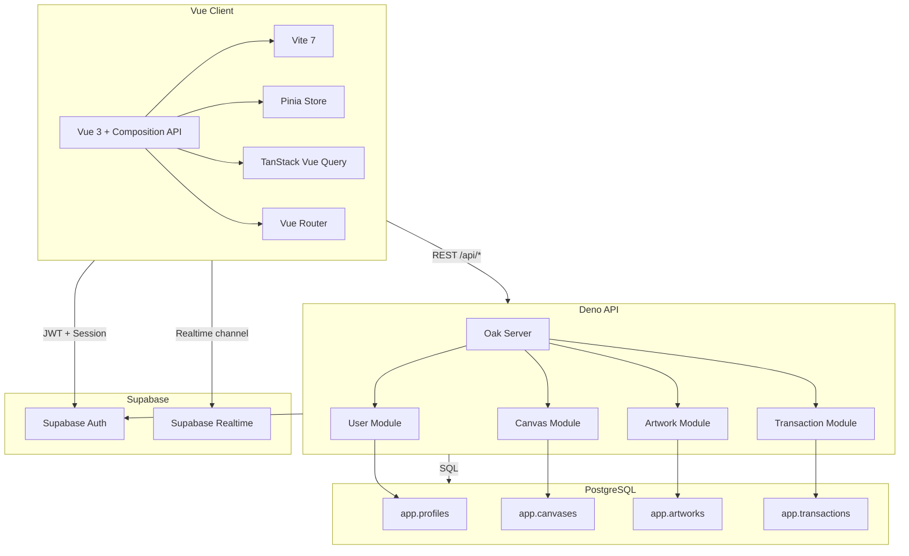
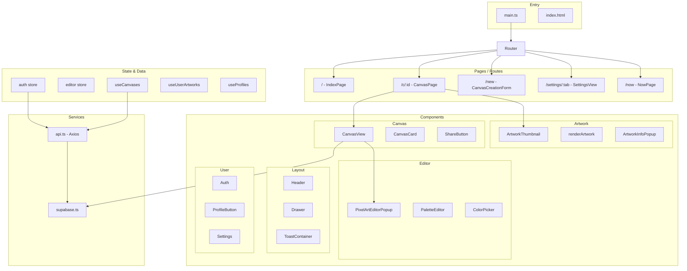
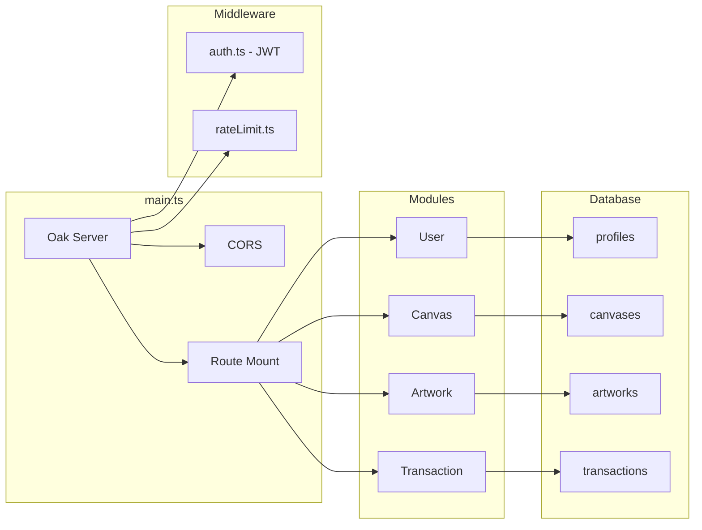
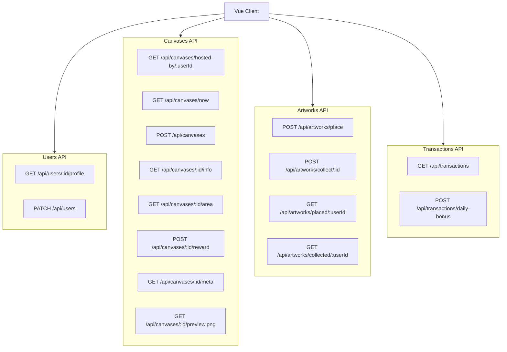
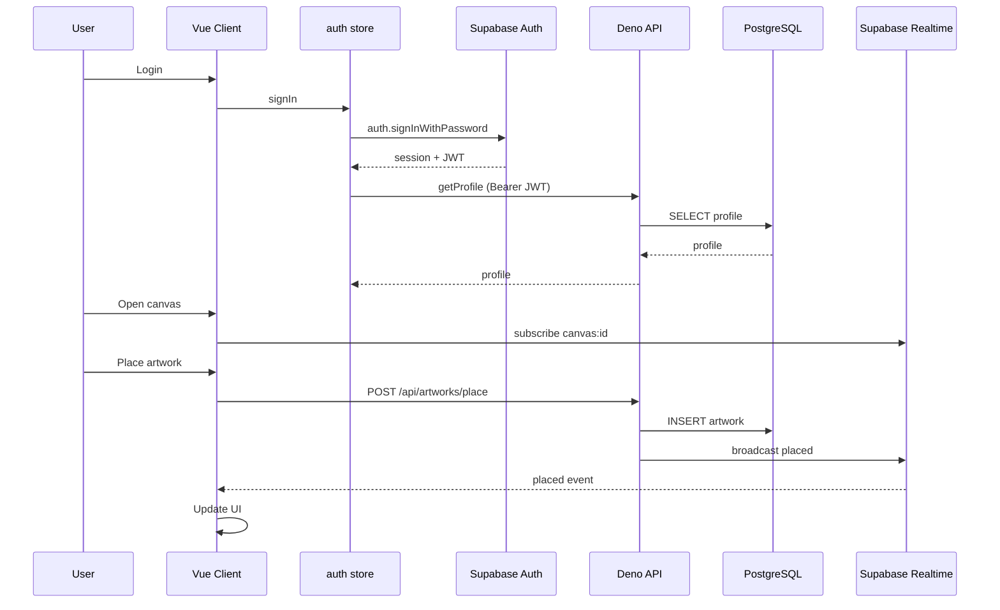

# Codebase Visualization Plan

This plan presents mermaid diagrams to visualize the **YouDroppedThis** codebase—an ephemeral collaborative pixel-art app with a Vue 3 frontend, Deno API backend, and Supabase infrastructure.

---

## 1. System Architecture (High-Level)

---

## 2. Frontend Structure

---

## 3. Backend API Modules

---

## 4. API Routes Map

---

## 5. Data Flow (Auth + Realtime)

---

## Summary

| Diagram                 | Purpose                                             |
| ----------------------- | --------------------------------------------------- |
| **System Architecture** | Client, API, Supabase, and PostgreSQL relationships |
| **Frontend Structure**  | Vue routes, components, stores, and services        |
| **Backend Modules**     | Oak server, middleware, and domain modules          |
| **API Routes Map**      | All REST endpoints grouped by resource              |
| **Data Flow**           | Auth and realtime interaction sequence              |

---

## Where to Put the Diagram

You can add these diagrams to:

- `**docs/architecture.md`** – New file for architecture documentation
- `**README.md**` – Inline in the project root
- `**.cursor/rules/**` – If you use Cursor rules for context

If you want, I can create `docs/architecture.md` with these diagrams when you switch to agent mode.